# ***Manual de Uso para Framework de comportamientos de enemigos para videojuegos 2D***
[🇬🇧 Read in English](./Manual/Manual_en.md)  
***Bienvenido al manual de uso.***  
**Creadores:** Cristina Mora Velasco y Francisco Miguel Galván Muñoz  
**Fecha:** Marzo de 2025

## Índice
- [Introducción](#introducción)
- [Objetivo](#objetivo)
- [Funcionalidad](#funcionalidad)
- [Público Objetivo](#público-objetivo)
- [Requisitos](#requisitos)
- [Instalación](#instalación)
- [Contenido del Paquete](#contenido-del-paquete)
- [Componentes Detallados](#componentes-del-framework)
  - [Máquina de Estados Finita (FSM)](#máquina-de-estados-finita-fsm)
  - [Estado (State)](#estado-state)
  - [Sensores](#sensores)
  - [Actuadores](#actuadores)
  - [Animator Manager](#animator-manager)
- [Ejemplos Prácticos](#ejemplos-de-uso)
  - [Ejemplo básico](#ejemplo-básico)
  - [Ejemplo intermedio](#ejemplo-intermedio)
  - [Ejemplo avanzado](#ejemplo-avanzado)
- [Solución de Problemas](#solución-de-problemas)
- [Preguntas Frecuentes](#preguntas-frecuentes)
- [Glosario](#glosario)
- [Contacto y Soporte](#contacto-y-soporte)

## Introducción
Este documento proporciona `instrucciones detalladas sobre cómo utilizar la herramienta de comportamiento de enemigos para videojuegos 2D`.  
Este manual se divide en varias secciones que cubren todos los aspectos necesarios para la instalación y el uso de la herramienta. Inicialmente, se guiará al usuario a través del proceso de instalación desde un repositorio de GitHub. A continuación, se detallará la arquitectura de la herramienta, explicando los componentes clave y el concepto de las Máquinas de Estados Finitas. Posteriormente, se presentará un flujo de trabajo paso a paso para la creación de nuevos enemigos, incluyendo la configuración de estados, transiciones, sensores y actuadores. Finalmente, se ofrecerán consejos y mejores prácticas para el diseño de enemigos efectivos, así como información sobre cómo obtener soporte técnico.

## Objetivo 
Este manual tiene como objetivo proporcionar una guía clara y detallada para que los usuarios puedan instalar, configurar y utilizar la herramienta con mayor facilidad.  
`La herramienta ha sido diseñada para simplificar y optimizar el proceso de creación de enemigos 2D funcionales dentro del entorno de Unity`. Utilizando una arquitectura basada en Máquinas de Estado Finito (FSM), permite a los diseñadores definir el comportamiento de los enemigos de manera visual e intuitiva, a través de la adición de estados y transiciones personalizadas.

## Funcionalidad
- Creación y gestión de comportamientos de enemigos en 2D.
- Implementación de máquinas de estados para definir la IA de los enemigos.

## Público objetivo
Tanto la herramienta como el manual han sido `creados para diseñadores o personas sin conocimientos avanzados en programación`.  
Si bien `se recomienda tener un conocimiento básico de Unity` y de los conceptos fundamentales del desarrollo de juegos, este manual se ha elaborado con la intención de ser lo suficientemente completo como para que usuarios con distintos niveles de experiencia puedan utilizar la herramienta de manera efectiva.

## Requisitos
Antes de comenzar, asegúrate de cumplir con los siguientes requisitos:
- Disponer de una versión igual o superior a `2022.3.18 (LTS)` de Unity.

## Instalación
Paso a paso para la instalación:  
1. **Descarga de la Herramienta desde GitHub:**
   - La herramienta se distribuye como un paquete de Unity a través de una URL de GitHub. Para obtener la herramienta, accede al [Link](https://github.com/CiscoGalvan/TFG/blob/main/Package/FrameworkEnemies2D.unitypackage).
   - Una vez en el repositorio, presiona las teclas `Control + Shift + S` o haz clic en `More File Actions` (botón de los tres puntos) y selecciona `Descargar`.
2. **Abre Unity y carga tu proyecto o crea un nuevo proyecto 2D.**
3. **En Unity, ve a `Assets > Import Package > Custom Package`.**
4. **Selecciona el archivo descargado (`.unitypackage`).**
5. **Presiona `Importar` y asegúrate de marcar todas las opciones necesarias.**
6. **Una vez importado, verifica que los activos de la herramienta aparecen en la ventana `Project` de Unity.**

## Contenido del Paquete
### 📂 `Scripts`
- Contiene los scripts necesarios para el funcionamiento del framework.
- Incluye lógica de gestión de estados, comportamientos de enemigos y detección de colisiones.
- Organizados en subcarpetas según su funcionalidad (`FSM`, `Actuators`, `SensorsAndEmitters`, `Editors`, `PlayerBehaviour`, `Basic Components`, `Editors`, `Animation`).

### 🎮 `Scenes`
- Contiene escenas de ejemplo con enemigos funcionales.
- Cada escena muestra configuraciones distintas.

### 🏗️ `Prefabs`
- Incluye prefabs de enemigos preconfigurados listos para su uso.

### 🎞️ `Animations`
- Contiene clips de animación de enemigos.
- Incluye animaciones como `Idle`, `Walk`, `Attack` y `Death`.
- Compatible con el sistema de `Animator` de Unity.

## Componentes del Framework
### Máquina de Estados Finita (FSM)
  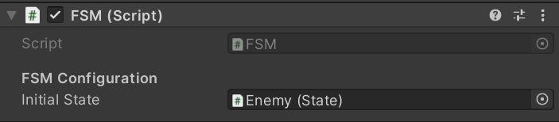  
  La FSM es la encargada de llamar y gestionar todos los estados de un enemigo.  
  Es necesario especificarle cuál va a ser el `estado inicial` del enemigo.

### Estado
  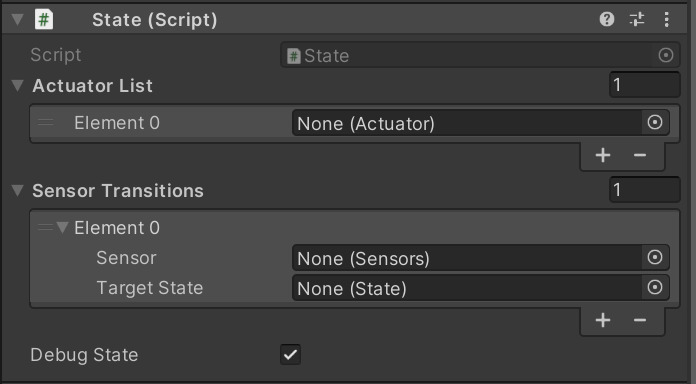  
  Dentro de cada estado debemos especificar qué acción/acciones vamos a realizar en `Actuator List`.  
  Para poder tener `Transiciones` de un estado a otro, se debe especificar el sensor que estará encargado de detectar ese cambio y el estado al que se desea pasar.
  En caso de que queramos que en el estado se realice daño, se deberá especificar que `DamageEmitter` se encontrará activo.   
  Por último, si deseamos `ver mediante Gizmos` información sobre el movimiento que se va a realizar, debemos activar el `Debug State`.

### Sensores
Los sensores permiten detectar información del entorno y activar transiciones. Disponemos de cinco sensores:

- **Area Sensor:**  
  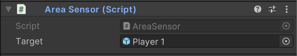  
  El sensor de área detecta cuando un objeto específico (Target) entra dentro de su zona de detección. 
  Este sensor hace que el Collider asociado al objeto pase a ser un `Trigger`. 

- **Collision Sensor:**  
  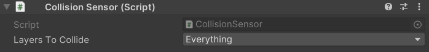  
  Detecta cuando el enemigo choca físicamente con otro objeto. A diferencia del `Area Sensor`, este requiere una colisión real en lugar de solo detectar la presencia dentro de un área. 
  Se debe especificar que `capas` activan el sensor. 

- **Distance Sensor:**  
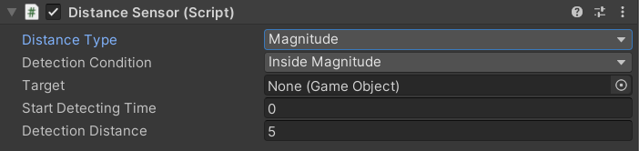  
  Detecta cuando un objeto específico (Target) está a una `determinada distancia del enemigo`.  
  Se requiere una `condición de detección` siendo estas:
  -  Estar dentro de la distancia de detección.
  -  Estar fuera de ella. 
  
  Es necesario especificar el `tiempo que está inactivo al inicio` (Start Detecting Time), si este es 0 el sensor inicia activado. 

- **Time Sensor:**    
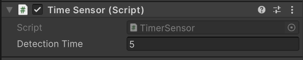  
 Detecta cuando pasa un `tiempo` específico.

- **Damage Sensor:**  
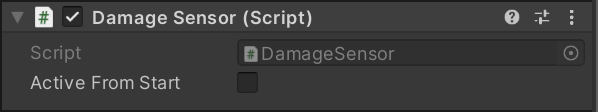  
  Detecta cuando una entidad `recibe daño`.
  Este sensor es utilizado a la hora de gestionar la `vida` tanto de los enemigos como del propio jugador.  Para que se pueda recibir daño se debe tener `Active From Start` a true. 

- **Damage Emitter:**  
  Es el encargado de `hacer daño`, en el tienes que especificar el tipo de daño, cada tipo de daño tiene sus propios parámetros:
  - Instant:  
  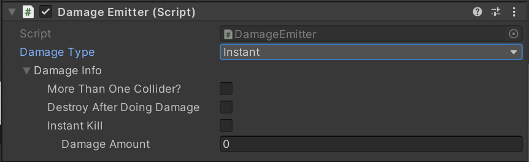  
  El daño instantáneo es aquel que te afecta una única vez al entrar en contacto contigo. Como parámetros, podremos especificar si queremos que se `elimine el objeto después de hacer daño`, si queremos que `directamente mate a la entidad con la que colisiona`. En caso de no querer que elimine directamente el objetivo, indicaremos el `daño que queremos hacerle`.
  - Persistent:  
 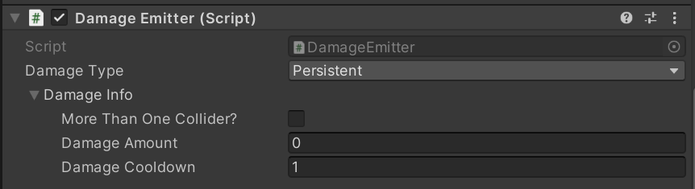  
 El daño persistente es el que te afecta mientras que estés dentro del objeto. Como parámetros, podremos especificar la `cantidad de daño` que hacemos y `cada cuanto` lo hacemos.
  - Residual:  
   
 Por último tenemos el daño residual. Este es el que te va afectando incluso cuando ya no estás en contacto. Como parámetros, podremos especificar si queremos que se `destruya el objeto después del primer contacto`, la `cantidad de daño al primer golpe` (que generalmente suele ser más grande), `cantidad de daño por aplicación`, `cada cuanto` y `cuantas` aplicaciones de daño residual se hacen.
---

### Actuadores
Los actuadores permiten realizar acciones durante los estados de los enemigos. Disponemos de 7 tipos de actuadores:

- **Spawner Actuator**:   
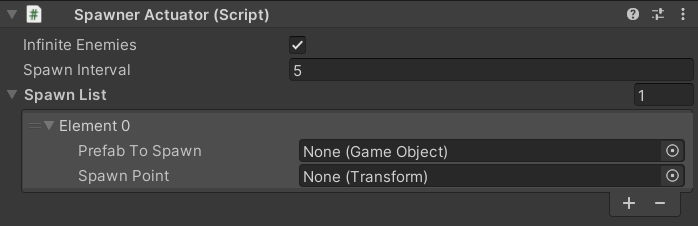  
  Permite generar (spawnear) nuevos enemigo.  
  - `Infinite Enemies:` si se quiere crear infinitos enemigos, en caso contrario se debe especificar la cantidad de veces que vamos a spawnear la lista.
  - `Spawn Interval:` cada cuanto tiempo se crean.
  - `Prefab to Spawn:` objeto que queremos crear.
  - `Spawn Point:` posición donde queremos que se cree el objeto.

  Al ser una lista, podemos spawnear más de un objeto a la vez.

- **Horizontal Actuator**:  
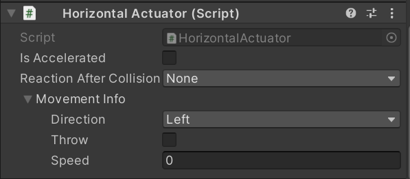  
Este actuador permite mover un objeto horizontalmente, ya sea a la izquierda o a la derecha, con diferentes configuraciones de velocidad y comportamiento tras una colisión. Tiene distintas configuraciones.

  - `Reaction After Collision`  
  Define qué sucede cuando el objeto choca contra otro:
    - `None:` No hay ninguna reacción al colisionar.
    - `Bounce:` El objeto cambia de dirección y sigue moviéndose en sentido contrario.
    - `Destroy:` El objeto desaparece al colisionar.
  - `Direction `  
  Determina hacia dónde se mueve el objeto:
    - `Left:` El objeto se moverá hacia la izquierda.
    - `Right:` El objeto se moverá hacia la derecha.
  - `Is Accelerated`  
    - `Falso:` Si no es acelerado, el enemigo se moverá con una velocidad lineal constante. Se podrá configurar:  
      - `Throw:` Se aplicará una única vez la fuerza, simulando un lanzamiento
      - `Speed:` Establece la velocidad a la que se moverá el objeto    
    - `Verdadero:` Si el movimiento si es acelerado, la velocidad irá aumentando:
      - `Goal Speed:` Es la velocidad máxima que alcanzará el objeto después de acelerar.
      - `Interpolation Time:`Es el tiempo que tarda el objeto en pasar de velocidad 0 a su velocidad objetivo.
      - `Easing Function:` Define cómo se comporta la aceleración

- **Vertical Actuator**:  
 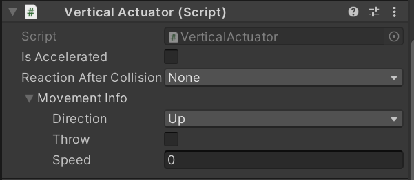  
  Este actuador permite mover un objeto vertical, ya sea a arriba o a abajo, con diferentes configuraciones de velocidad y comportamiento tras una colisión. Tiene distintas configuraciones.

  - `Reaction After Collision`  
  Define qué sucede cuando el objeto choca contra otro:
    - `None:` No hay ninguna reacción al colisionar
    - `Bounce:` El objeto cambia de dirección y sigue moviéndose en sentido contrario.
    - `Destroy:` El objeto desaparece al colisionar.
  - `Direction `  
  Determina hacia dónde se mueve el objeto:
    - `Up:` El objeto se moverá hacia arriba.
    - `Down:` El objeto se moverá hacia abajo.
  - `Is Accelerated`  
    - `Falso:` Si no es acelerado, el enemigo se moverá con una velocidad lineal constante. Se podrá configurar:  
      - `Throw:` Se aplicará una única vez la fuerza, simulando un lanzamiento
      - `Speed:` Establece la velocidad a la que se moverá el objeto    
    - `Verdadero:` Si el movimiento si es acelerado, la velocidad irá aumentando:
      - `Goal Speed:` Es la velocidad máxima que alcanzará el objeto después de acelerar.
      - `Interpolation Time:`Es el tiempo que tarda el objeto en pasar de velocidad 0 a su velocidad objetivo.
      - `Easing Function:` Define cómo se comporta la aceleración

- **Directional Actuator**:  
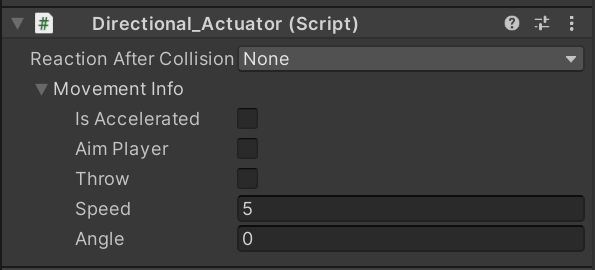  
  Hace que el enemigo se mueva en una dirección específica descrita por un ángulo.
   - `Reaction After Collision`  
  Define qué sucede cuando el objeto choca contra otro:
      - `None:` No hay ninguna reacción al colisionar
      - `Bounce:` El objeto cambia de dirección y simula un rebote.
      - `Destroy:` El objeto desaparece al colisionar. 
    - `Angle:`  Ángulo con el que va a moverse el objeto
    - `Aim Player:` Indica si el objeto va a seguir la dirección del jugador (con esta opción el ángulo no aparece porque se le da valor en función de tu posición y la del objetivo)
    - `Is Accelerated`  
      - `Falso:` Si no es acelerado, el enemigo se moverá con una velocidad lineal constante. Se podrá configurar:  
        - `Throw:` Se aplicará una única vez la fuerza, simulando un lanzamiento
        - `Speed:` Establece la velocidad a la que se moverá el objeto    
        
      - `Verdadero:` Si el movimiento si es acelerado, la velocidad irá aumentando:
        - `Goal Speed:` Es la velocidad máxima que alcanzará el objeto después de acelerar.
        - `Interpolation Time:`Es el tiempo que tarda el objeto en pasar de velocidad 0 a su velocidad objetivo.
        - `Easing Function:` Define cómo se comporta la aceleración

- **Circular Actuator**:  
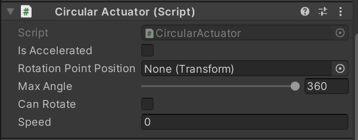  
 Permite movimientos circulares en torno a un punto de rotación determinado.
  - `Rotation Point Position`  
    Define el punto central sobre el cual se realiza la rotación.  
    - `None:` Si no se asigna, el objeto girará en torno a su propio centro.  
    - `Transform:` Si se asigna un objeto, la rotación se realizará alrededor de ese punto.  

  - `Max Angle`  
    Ángulo máximo que puede alcanzar el movimiento circular (360 indica un círculo completo, el resto de ángulos se comporta como un péndulo).  

  - `Can Rotate`  
    Determina si el objeto puede rotar sobre su propio eje además de moverse en círculo.  
    - `Falso:` El objeto solo se moverá en la trayectoria circular sin girar sobre sí mismo.  
    - `Verdadero:` El objeto girará sobre su propio eje mientras se mueve.  

  - `Is Accelerated`
    - `Falso:` Si no es acelerado, el objeto se moverá con velocidad constante definida por el parámetro `Speed`.  
    - `Verdadero:` Si es acelerado, la velocidad aumentará progresivamente según los siguientes parámetros:  
      - `Goal Speed:` Es la velocidad máxima que alcanzará el objeto.  
      - `Interpolation Time:` Es el tiempo que tarda el objeto en pasar de velocidad 0 a su velocidad objetivo.  
      - `Easing Function:` Define cómo se comporta la aceleración. 

- **Move to a Point Actuator**:  
Hace que el enemigo se mueva hacia un punto fijo específico del escenario. Hay dos configuraciones dependiendo del `Use Way`
  - `Random Area`  
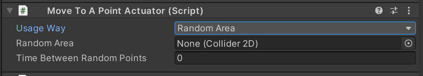   
Random area coge puntos aleatorios dentro de un área.
    - `Random Area:` Collider que servirá para la referencia del área
     - `Time Between Random Points:` Cada cuanto cambia el punto a otro distinto
  - `Waypoint`: Indica que queremos seguir un camino predeterminado de puntos
    - `Is A Cicle:` Indica si queremos que al llegar al final de los waypoints, se vuelva a iniciar la lista.
    - `Same Waypoints Behaviour:` Indica si queremos que el comportamiento sea el mismo para todos los waypoints.
      -  Si es así, se creará un panel único de especificiación de puntos:  
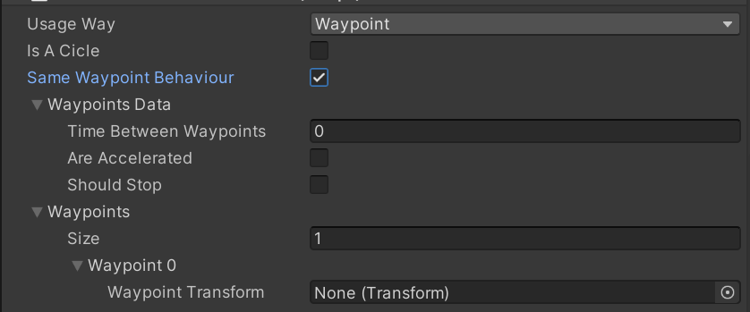  
          - `Time Between Waypoints:` tiempo que se tarda entre un punto y otro 
          - `Are Accelerated:` si el movimiento es acelerado o no. En caso de serlo, aparecerá una easing function que indicará con que aceleración se mueve. 
          - `Should Stop:` indica si debe o no parar al llegar a un punto. Si se debe parar, hay que  indicar cuanto tiempo.  
      - Si no es así, aparecerán los mismos datos por cada waypoint.  
    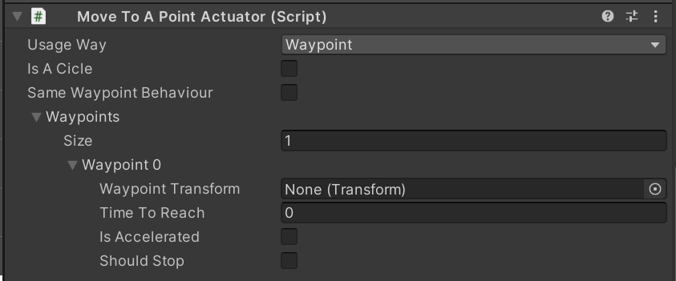  

  

- **Move to an Object Actuator**:  
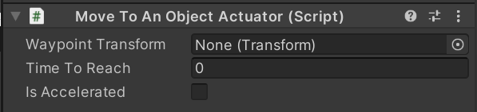  
  Hace que el enemigo se desplace automáticamente hacia un objeto determinado, si el objeto se mueve, el enemigo cambiará su dirección para ir hacia el objeto
  - `Waypoint Transformm:` Transform del objeto al que se quiere perseguir.
  - `Time to Reach:` Tiempo que tarda en llegar al objetivo
  - `Is Accelerated:`
    - `Falso:` Si no es acelerado, la posición cambiará de manera constante.  
    - `Verdadero:` Si es acelerado, la posición se definirá mediante la función de easing  
    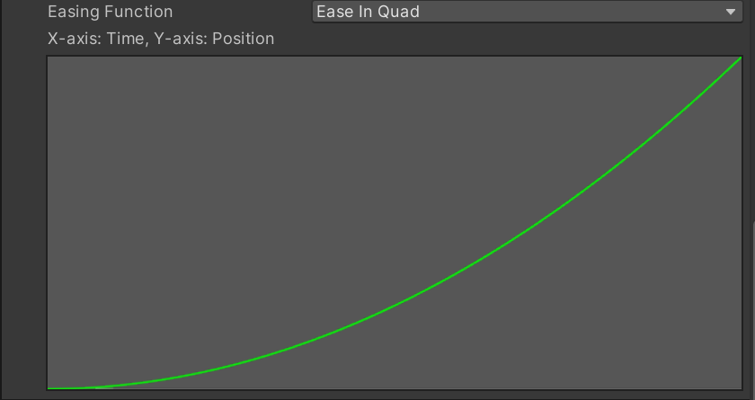  

### Animator Manager
Se encarga de gestionar las animaciones de los enemigos en función de sus estados y acciones. Si se quiere añadir una animación, es necesario añadir tambien un animator de Unity.  
Es importante que todos los Sprites que se quieran utilizar `se orienten hacia la derecha``.
### Life
Gestiona la vida de los objetos.  
 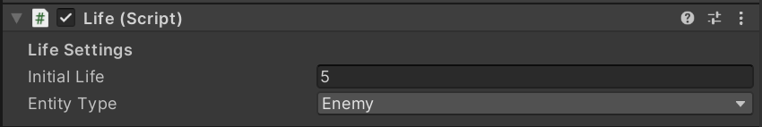  
 - `Initial Life:` vida inicial.
 - `Entity type:` tipo de entidad (player o enemy)
## Ejemplos de Uso

### Primer Ejemplo

## Solución de Problemas
| Problema                  | Solución                          |
|---------------------------|----------------------------------|
| El paquete inicia con errores en consola   | Verifica la instalación y dependencias del proyecto. |
| | |
| | |

## Preguntas Frecuentes
Sección para responder dudas comunes sobre el uso del software. A RELLENAR CUANDO HAGAMOS PRUEBAS DE USUARIOS

## Glosario
Lista de términos técnicos y sus definiciones para facilitar la comprensión del manual:
- ***Máquinas de estado finitas (FSM):*** Una Máquina de Estados Finita es un modelo computacional utilizado para diseñar algoritmos que describen el comportamiento de un sistema a través de un número limitado de estados posibles y las transiciones entre esos estados. En el contexto de la inteligencia artificial de los videojuegos, cada estado representa un comportamiento específico. Las transiciones entre estos estados se activan mediante condiciones específicas, a menudo generadas por la interacción del enemigo con su entorno.

- ***Estado:*** En una máquina de estados, un estado representa una situación en la que un enemigo puede encontrarse en un momento dado. Define las acciones del enemigo mientras se mantiene en dicho estado. Por ejemplo, un enemigo puede estar en estado `Idle`, `Patrol`, `Attack`, etc.

- ***Serializado:*** Permite modificar valores sin necesidad de cambiar el código, editandolos desde el editor de Unity.
- ***Transform:*** Es un componente de Unity que almacena y gestiona la posición, rotación y escala de un objeto en la escena. Es fundamental para manipular cualquier objeto dentro del mundo del juego, ya que permite moverlo, rotarlo y escalarlo.

- ***Serializado:*** En términos simples, significa que la información de un objeto puede guardarse y recuperarse más tarde sin perder sus datos. En Unity, esto se usa para recordar configuraciones o guardar partidas.

## Contacto y Soporte

Se recomienda revisar escenas de ejemplo y documentación adicional de los desarrolladores.
Para obtener soporte técnico adicional o para proporcionar comentarios sobre la herramienta, puede contactar directamente a los desarrolladores a través de los siguientes medios: [soporte@ejemplo.com](mailto:soporte@ejemplo.com).

---
© 2025 Cristina Mora Velasco y Francisco Miguel Galván Muñoz. Todos los derechos reservados.
